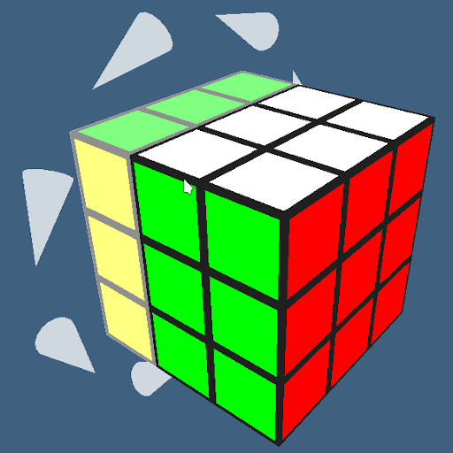

# Smart Cube

A [progressive web app](https://en.wikipedia.org/wiki/Progressive_web_application) for solving the *Mi Smart Magic Cube* (a Rubik's cube with Bluetooth LE from Xiaomi) that simply always shows the next step for solving the cube.

Requires a webbrowser that supports the *[Web Bluetooth API](https://webbluetoothcg.github.io/web-bluetooth/)*. Right now, recent Chrome-based webbrowsers are the only ones that do.

To use it, visit [https://oyooyo.github.io/smart_cube](https://oyooyo.github.io/smart_cube).

## Acknowledgements

This project uses...
- a modified version of [xiaomi-mi-smart-rubik-cube](https://github.com/wachino/xiaomi-mi-smart-rubik-cube) for getting the cube's state
- [cube.js](https://github.com/ldez/cubejs) for solving the cube (using [Herbert Kociemba's two-phase algorithm](http://kociemba.org/cube.htm))
- [three.js](https://threejs.org/) for the 3D graphics
- [React](https://reactjs.org/) and [create-react-app](https://github.com/facebook/create-react-app)
- [bootstrap](https://getbootstrap.com/)
